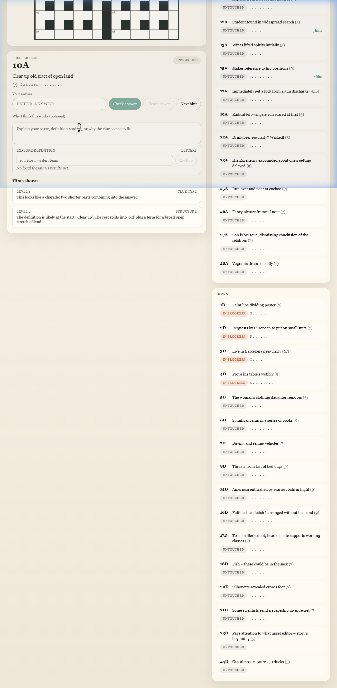

# Cryptic Crossword Solver: A Neuro-Symbolic Approach

A hybrid AI system that combines LLM reasoning with algorithmic solvers to crack cryptic crosswords — plus an interactive tutor UI for learning how cryptic clues work.



## What Are Cryptic Crosswords?

Cryptic crosswords are puzzles where each clue is a miniature word puzzle with two paths to the answer:

- **The definition** — a synonym or description of the answer, always at the start or end of the clue.
- **The wordplay** — instructions for constructing the answer letter-by-letter through mechanisms like anagrams, hidden words, reversals, or charades.
- **The surface reading** — the clue is written to read as a plausible (if odd) English sentence, which is deliberate misdirection.

**Example:** *"The role is complicated for those with paying guests (9)"*

- **Definition:** "those with paying guests" → HOTELIERS
- **Wordplay:** "The role is" = THEROLEIS, "complicated" = anagram indicator → rearrange THEROLEIS → HOTELIERS
- **Surface reading:** reads as though someone's role is complicated — pure misdirection.

## The Neuro-Symbolic Thesis

Neither an LLM nor a pure algorithmic solver can handle cryptic crosswords effectively alone:

- **LLMs** understand language — they can recognise that "complicated" signals an anagram, that "those with paying guests" defines HOTELIERS, and parse the misdirecting surface reading. But tokenisation makes them fundamentally unreliable at letter-level mechanics: they cannot reliably confirm that THEROLEIS rearranges into HOTELIERS, or count that a hidden word spans exactly 7 characters.

- **Algorithms** handle mechanics perfectly — anagram enumeration, pattern matching, dictionary validation — but they have no world knowledge. They cannot decide which part of a clue is the definition, which word is the indicator, or whether a candidate actually means what the clue asks.

Together they cover each other's weaknesses. The LLM handles *interpretation* (parsing, indicator recognition, definition matching). The algorithms handle *execution* (candidate generation under mechanical constraints). A final LLM evaluation step confirms that algorithmic candidates fit the definition.

## Worked Example

### Anagram: "The role is complicated for those with paying guests (9)"

**Step 1 — Indicator detection:** "complicated" is recognised as an anagram indicator.

**Step 2 — Fodder extraction:** The wordplay side is "The role is" = THEROLEIS (9 letters, matching the enumeration).

**Step 3 — Algorithmic solver:**
```bash
python cryptic_skills/anagram.py --fodder THEROLEIS --pattern .........
# → {"candidates": ["hoteliers"]}
```

**Step 4 — Semantic confirmation:** The LLM verifies that "those with paying guests" = HOTELIERS. Confidence: 0.93.

**Step 5 — Grid commit:** HOTELIERS is placed in the grid. Checking letters propagate to crossing clues, constraining their search space.

### Initials: "wine honey enough now — for starters (4)"

**Step 1 — Indicator detection:** "for starters" signals an initial-letters clue.

**Step 2 — Letter extraction:** Take the first letter of each word: **W**ine **H**oney **E**nough **N**ow → WHEN.

**Step 3 — Validation:** WHEN is in the dictionary and matches the pattern. Confidence: 0.93.

No external solver call is needed — the `HeuristicAdapter` extracts initials directly and validates against the wordlist.

## Try It: Interactive Tutor

The tutor UI lets you solve cryptic crosswords with guided hints and real-time validation.

### Local development

```bash
# Start the backend
pip install -r requirements.txt
python -m uvicorn app.main:app --app-dir backend --reload --host 127.0.0.1 --port 8000

# In a separate terminal, start the frontend
cd visualizer
npm install
npm run dev
```

Open `http://127.0.0.1:5173`. Select a clue, type your answer, and submit. Request hints (5 progressive levels from clue-type identification to full reveal), check answers against the solver engine, and watch crossing letters propagate through the grid.

Local development now uses explicit API addressing rather than a Vite proxy. The SPA talks to `http://127.0.0.1:8000` via `VITE_API_BASE_URL`, so moving the API elsewhere later is just a frontend base-URL change.

### Split hosting

The current codebase supports split hosting with:

- `visualizer/` deployed as a static SPA
- `backend/` deployed as a separate FastAPI service

Minimum environment needed:

```bash
# Frontend
VITE_API_BASE_URL=https://your-backend-host.example.com

# Backend
CROSSWORD_CORS_ORIGINS=https://your-frontend-host.example.com
```

This keeps the browser app talking to the backend by full URL in both local development and split-hosted production.

For the fuller setup and deployment notes, see [visualizer/README.md](visualizer/README.md), [backend/README.md](backend/README.md), and [docs/hosting.md](docs/hosting.md).

See [visualizer/README.md](visualizer/README.md) for the full component map and source layout.

## Try It: Autonomous Agent

The solver can also run autonomously in any agent harness that can read `SKILL.md`, invoke local tools, and maintain a puzzle workspace:

**Option 1: `.skill` package** — Load `cryptic-solver.skill` into a compatible `SKILL.md`-aware runtime.

**Option 2: Clone and mount**
```bash
git clone https://github.com/nikcholer/cryptic-solver.git
pip install -r requirements.txt
```
Point your harness's skill search path at this repository. The agent will read `SKILL.md` and invoke the CLI solvers autonomously.

Codex is the reference harness currently documented in this repo, but the workflow is intentionally framed around `SKILL.md` compatibility rather than any single provider-specific runtime.

### Capability-based model allocation

The agent protocol uses capability roles rather than provider names:

| Role | Purpose |
|------|---------|
| `lite` | Fast, cheap candidate generation and broad recall |
| `reasoner` | Ambiguity resolution, semantic ranking, explanation |
| `vision` | Puzzle image reading, OCR, grid-layout extraction |

The runtime maps these roles to actual models, credentials, and endpoints. See `config/model-routing.example.yaml`.

## Architecture Overview

```
┌─────────────────────────────────────────────────────────┐
│                    Human or LLM                         │
│              (tutor UI  /  agent runtime)               │
└────────────────────────┬────────────────────────────────┘
                         │
          ┌──────────────▼──────────────┐
          │     FastAPI Backend          │
          │  (sessions, grid engine,     │
          │   heuristic adapter)         │
          └──────────────┬──────────────┘
                         │
          ┌──────────────▼──────────────┐
          │   cryptic_skills/*.py        │
          │  (anagram, hidden, reversal, │
          │   insertion, charade,        │
          │   grid_manager)              │
          └──────────────┬──────────────┘
                         │
          ┌──────────────▼──────────────┐
          │   Data files                 │
          │  (words.txt, abbreviations,  │
          │   indicators, thesaurus)     │
          └─────────────────────────────┘
```

The backend detects clue types via indicator word matching, extracts fodder, calls the appropriate CLI solver, and validates candidates against the dictionary. An optional external LLM (configured via `CROSSWORD_RUNTIME_COMMAND`) provides semantic judgement and richer hints.

Full grid solving treats the puzzle as a Constraint Satisfaction Problem: high-confidence clue types (hidden words, anagrams) are solved first, their crossing letters constrain neighbouring clues, and the solver sweeps until no more progress can be made.

See [docs/architecture.md](docs/architecture.md) for the full technical reference.

### Why This Pattern Matters Beyond Crosswords

This project demonstrates a **neuro-symbolic orchestration pattern**: use LLMs for interpretation and judgement, delegate mechanical operations to deterministic tools, and close the loop with a semantic evaluation step. The same architecture applies wherever AI needs to work alongside rule-based systems — regulatory compliance, data transformation pipelines, scientific computation, or game engines.

## Clue Types

| Clue Type | Algorithmic Role | LLM Role | Solver Script |
|-----------|-----------------|----------|---------------|
| Anagram | Generate all dictionary anagrams of fodder | Detect indicator, extract fodder, confirm definition | `anagram.py` |
| Hidden word | Slide window across fodder text | Spot hidden-word indicator, identify fodder span | `hidden.py` |
| Reversal | Reverse fodder, validate against dictionary | Detect reversal indicator, identify fodder | `reversal.py` |
| Container | Insert inner element into outer, validate | Identify which element goes inside which | `insertion.py` |
| Charade | Concatenate abbreviations/synonyms, validate | Parse which components combine, identify abbreviations | `charade.py` |
| Initials/Acrostics | Extract first letters mechanically | Detect "initially"/"for starters" indicators | Built-in |
| Double definition | Pattern-filter dictionary candidates | Deep semantic matching against both definitions | Pattern only |
| Cryptic definition | Pattern filtering, n-gram frequency | World knowledge, phrase recognition | Pattern only |
| Homophone | Phonetic engine mapping (CMUdict) | Judge plausibility, select intended synonyms | Planned |

## Project Structure

```
cryptic-solver/
  SKILL.md                  — agent instruction document (machine-facing)
  cryptic_skills/           — CLI solver scripts and data files
  backend/                  — FastAPI application (API, services, runtime adapter)
  visualizer/               — React + TypeScript tutor UI
  samples/                  — sample puzzle definitions
  backend_data/             — live session state (runtime)
  config/                   — example deployment configs
  docs/                     — architecture and design documents
```

## Data Files

`cryptic_skills/words.txt` is an English wordlist (~370 K entries) used for candidate validation. It is derived from public-domain word lists and is included for development convenience. If you redistribute this project, verify compatibility with your intended use.

## Development

- [backend/README.md](backend/README.md) — running the backend, smoke tests, edge-case harness, runtime configuration
- [visualizer/README.md](visualizer/README.md) — tutor UI setup, component map, source layout
- [CONTRIBUTING.md](CONTRIBUTING.md) — dev onboarding, adding new solvers, code conventions

## Design Documents

- [docs/architecture.md](docs/architecture.md) — full technical reference: pipeline stages, solver inventory, grid orchestration, runtime abstraction
- [docs/interactive-tutor-backend.md](docs/interactive-tutor-backend.md) — original design specification for the tutor backend (implemented)
- [docs/agent-instructions-improvement-plan.md](docs/agent-instructions-improvement-plan.md) — roadmap for reliability, safety, and determinism improvements to `SKILL.md`


